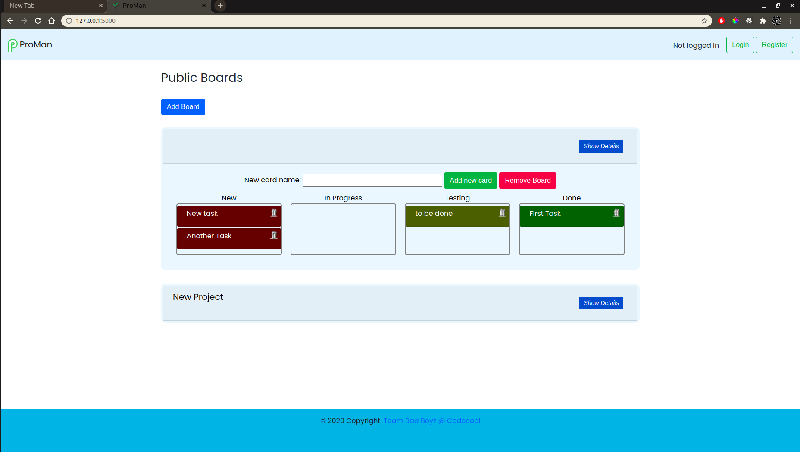
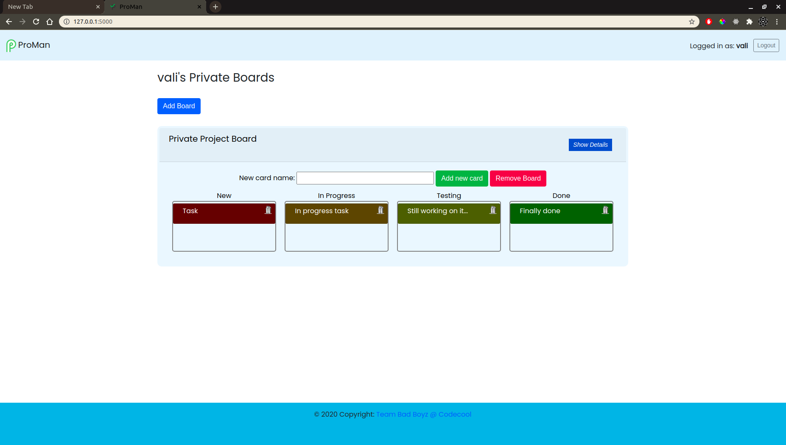

# ProMan 

## About the project

ProMan is a new project management tool (such as trello).

Users can create boards and cards with tasks.

The boards and cards titles are editable. 

A person can create and public boards and public tasks without the need to login or register. Everyone can see the public boards and alter them.

You can easily switch the cards between statuses, whenever the status of that task is changed.

Users can register or login to make private boards.

## Technologies used

- Python/Flask
- Javascript
- Html/CSS
- Postgresql

## To run this project

- Make a virtual environment
- Install the requirements.txt
